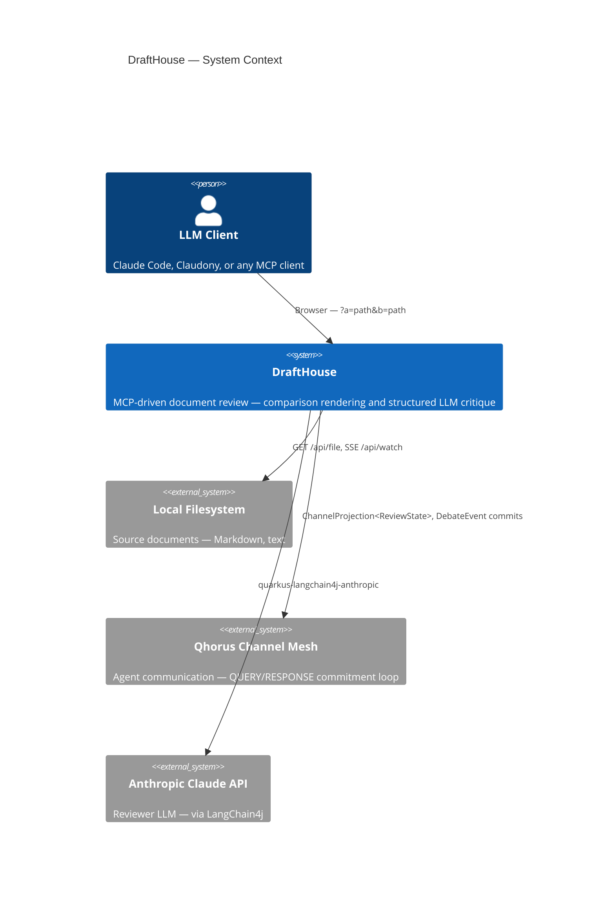
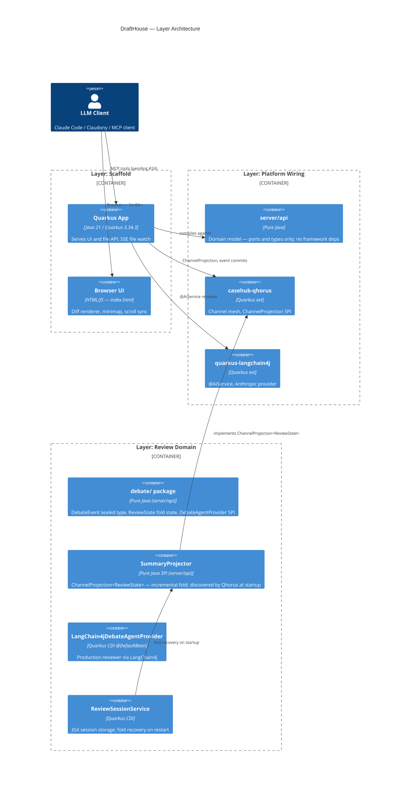
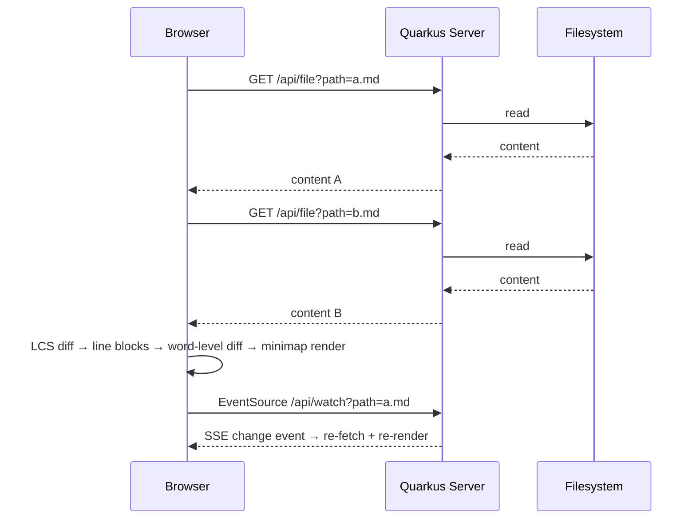
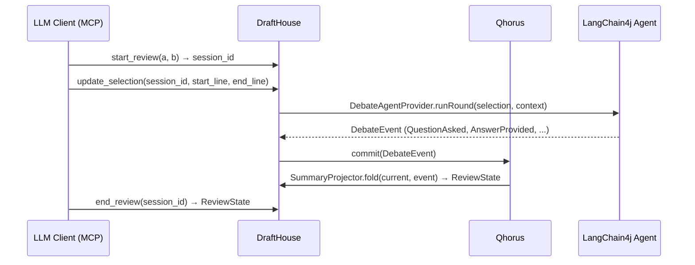
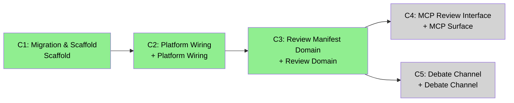

# DraftHouse — ARC42STORIES.MD

**Spec:** Arc42Stories v0.1
**Profile:** CaseHub — Application tier
**Profile ref:** `../parent/docs/arc42stories-casehub-profile.md` · fallback: `https://raw.githubusercontent.com/casehubio/parent/main/docs/arc42stories-casehub-profile.md`
**Prefix:** DH

---

## §1 Introduction and Goals

DraftHouse is an MCP-driven document review tool. An LLM client opens a document, loads before/after versions, initiates reviewer agents, and conducts selection-scoped conversations grounded in specific document regions. It runs as a Quarkus application with a browser-based diff UI and a Qhorus-backed review pipeline, designed for eventual embedding in Claudony as a channel view type.

**Stakeholders**

| Stakeholder | Interest |
|---|---|
| LLM clients (Claude Code, Claudony, any MCP client) | MCP tool surface for session control |
| Document authors | Comparison rendering, change navigation |
| Document reviewers | Structured critique scoped to selections |
| CaseHub platform team | Alignment with Qhorus channel model and Claudony plugin API |

**Top quality goals**

| # | Goal | Scenario |
|---|---|---|
| 1 | Portability | Domain logic imports into Claudony without framework changes |
| 2 | MCP-first API | All review session control available as MCP tools |
| 3 | Provider replaceability | LangChain4j replaced with Claude Agent SDK without domain changes |

**Artifact schema**

| Artifact type | Format | Example | Where it lives |
|---|---|---|---|
| Improvement log entry | `DH-NNN` | `DH-042` | `docs/PROGRESS.md` |
| Issue | `#NNN` or `casehubio/drafthouse#NNN` | `#24` | GitHub Issues |
| Garden entry | `GE-YYYYMMDD-XXXXXX` | `GE-20260601-85afd0` | `~/.hortora/garden/` |
| Protocol | `PP-YYYYMMDD-XXXXXX` | `PP-20260601-abc123` | `casehub-parent/docs/protocols/` |
| ADR | `ADR-NNNN` | `ADR-0001` | `docs/adr/` |
| Blog entry | `YYYY-MM-DD-[initials]NN-title` | `2026-05-25-mdp01-bug-that-count-was-hiding` | `blog/` |
| Design spec | `YYYY-MM-DD-topic-design` | `2026-06-01-review-manifest-design` | `docs/superpowers/specs/` |

---

## §2 Constraints

| Constraint | Detail |
|---|---|
| Java 17 | Sealed types required for `DebateEvent` |
| Quarkus 3.34.3 | Platform BOM version |
| casehub-qhorus 0.2-SNAPSHOT | Pre-release; `ChannelProjection` SPI (qhorus#230) required |
| quarkus-langchain4j 1.9.1 | Built against Quarkus 3.33.1; validated on 3.34.3; 0.x line incompatible |
| CaseHub parent BOM | `casehubio/parent` — no dependency version overrides outside BOM |
| Browser-only UI | No Electron, no npm build step |
| Filesystem access | Documents read from local filesystem; no upload or remote fetch |
| Claude Agent SDK | Coordinates not on Maven Central (platform#55); provider is a stub |

---

## §3 Context and Scope

**System boundaries**

| In scope | Out of scope |
|---|---|
| Document loading and comparison rendering | Document storage and version control |
| Review session lifecycle (start → rounds → close) | Review outcome actioning |
| Reviewer agent dispatch via Qhorus | Agent identity management (casehub-eidos) |
| MCP tool surface | UI hosting and distribution packaging |

**Platform references**

- `../parent/docs/PLATFORM.md` — capability ownership table and boundary rules
- `../parent/docs/repos/drafthouse.md` — what this application owns (🔲 parent#145 pending)

---

## §4 Solution Strategy

**Before:** `mdproctor/md-compare` — a standalone Electron app; IPC-based file loading; npm build pipeline; no review capability.

**After:** Quarkus application serving a browser UI; MCP tools replacing Electron IPC; pure-Java review domain enabling Claudony embedding.

What this strategy establishes:
- **Standalone today, Claudony plugin tomorrow** — diff engine, domain pipeline, and review anchoring are pure-Java with no UI framework coupling; when Claudony's plugin API stabilises they import as JARs unchanged
- **MCP-first API** — LLM clients control review sessions via tools, not browser UI; the browser is a visualisation surface only
- **Dual provider abstraction** — LangChain4j runs production; `ClaudeAgentSdkDebateAgentProvider @Alternative @Priority(1)` displaces it without configuration change when platform#55 delivers coordinates
- **Minimal delta sequencing** — infrastructure established first; domain model second; MCP surface and channel integration third; each Chapter adds one concern

**Chapter sequencing rationale:**
- C1 before C2: Quarkus application and module structure required before Qhorus and LangChain4j can be wired
- C2 before C3: Framework dependencies required before `DebateAgentProvider` and `ChannelProjection` can compile and test
- C3 before C4: `ReviewSessionService` and `DebateAgentProvider` required before MCP tools can be implemented
- C4 and C5 independent: MCP surface does not depend on Qhorus `DebateChannel` type; channel type does not depend on MCP surface; either can ship first

---

## §5 Building Block View

**Module structure**

| Module | Type | Responsibilities |
|---|---|---|
| `server/api/` | Pure-Java JAR | Domain model — `DebateEvent`, `ReviewState`, `ReviewPoint`, `DebateAgentProvider` SPI; no Quarkus or Qhorus compile-scope deps |
| `server/runtime/` | Quarkus app | All JAX-RS resources, Qhorus wiring, LangChain4j agents, REST stubs; depends on `server/api/` |
| `server/claude-agent/` | Optional JAR | `ClaudeAgentSdkDebateAgentProvider @Alternative @Priority(1)` stub — not a runtime dep until platform#55 ships |
| `index.html` | Browser UI | Diff engine (LCS), word-level highlights, canvas minimap, scroll sync — no build step |
| `styles.css` | Browser assets | Archive Room CSS tokens, panel/diff/minimap styles |

**Layer architecture**

---

## §6 Runtime View

**Scenario 1 — File comparison**

Browser loads `?a=<path>&b=<path>`, fetches both files from `/api/file`, computes LCS diff client-side, renders line blocks with word-level highlights and a canvas minimap. An `EventSource` on `/api/watch` reloads either file without a page refresh when a change is detected.

**Scenario 2 — Review session (pending MCP tools #24)**

Each round commits a `DebateEvent` to the Qhorus channel; `SummaryProjector` folds the new event into `ReviewState` without replay.

---

## §7 Deployment View

| Component | Value |
|---|---|
| Build output | `server/runtime/target/drafthouse-server-runner.jar` |
| Run command | `java -Dui.dir=<project-root> -jar drafthouse-server-runner.jar` |
| Default port | `9001` — override via `quarkus.http.port` |
| UI resolution | `-Dui.dir` JVM property → `UiResource` reads `index.html` and `styles.css` |
| Session storage | `~/.drafthouse/reviews/` (JGit; path configurable via #28) |
| Qhorus datasource | H2 in-memory with `MODE=PostgreSQL` for dev/test; PostgreSQL named `qhorus` for prod |
| Build command | `mvn -f server/pom.xml package -DskipTests` |

DraftHouse deploys as a single JVM process. No container or orchestration configuration exists.

---

## §8 Crosscutting Concepts

**Protocol references**

| Concern | Protocol |
|---|---|
| Module tier structure | `docs/protocols/universal/module-tier-structure.md` |
| CDI displacement (`@DefaultBean` / `@Alternative`) | `docs/protocols/casehub/alternative-extension-patterns.md` |
| Maven coordinate naming | `docs/protocols/universal/maven-coordinate-standard.md` |
| Capability ownership | `../parent/docs/PLATFORM.md` — Capability Ownership table |

**Anti-patterns**

**Symptom:** `ClaudeAgentSdkDebateAgentProvider` activates in tests and the reviewer produces no output.
**Cause:** `claude-agent/` added as a `<dependency>` in `server/runtime/pom.xml` before platform#55 ships; `@Alternative @Priority(1)` promotes the stub above the `@DefaultBean` LangChain4j provider with no warning.
**Fix:** Remove `claude-agent` from `server/runtime/pom.xml`. Re-add only when Maven Central coordinates from platform#55 are verified.

**Symptom:** Quarkus startup fails with `AiServicesProcessor` NPE or `@AiService` parameter names unresolved.
**Cause:** `<maven.compiler.parameters>true</maven.compiler.parameters>` is absent from `server/runtime/pom.xml`; `AiServicesProcessor` requires compiled parameter names at startup.
**Fix:** Add `<maven.compiler.parameters>true</maven.compiler.parameters>` to the `maven-compiler-plugin` configuration in `server/runtime/pom.xml`.

**Symptom:** `mvn test -pl runtime` fails with `Could not find artifact io.casehub.drafthouse:api`.
**Cause:** Selective `-pl` runs bypass the reactor install phase; `runtime` cannot resolve `api` from the local Maven repository.
**Fix:** Run `mvn install -DskipTests` on the full reactor before any selective `-pl runtime` test run.

---

## §9 Journeys and Chapters

### §9.1 Journey Overview

| Journey | Description | Chapters | Status |
|---|---|---|---|
| Document Comparison | Load two markdown files, render side-by-side diff with line highlights, word-level annotations, canvas minimap, and scroll sync | C1 | ✅ Complete |
| Document Review | Initiate a structured debate review: reviewer agents critique selection-scoped document regions via a Qhorus QUERY→RESPONSE commitment loop; state accumulated incrementally | C2–C5 | In progress |

### §9.2 Chapter Index

| # | Chapter | Journey | Layers touched | Delta summary | Status |
|---|---|---|---|---|---|
| 1 | CaseHub Migration & Scaffold | Comparison | Scaffold | High | ✅ |
| 2 | Platform Wiring | Review | Platform Wiring | High | ✅ |
| 3 | Review Manifest Domain | Review | Review Domain | High | ✅ |
| 4 | MCP Review Interface | Review | MCP Surface | High | 🔲 |
| 5 | Debate Channel | Review | Debate Channel | Medium | 🔲 |

**Layer × Chapter matrix**

| Layer | C1 | C2 | C3 | C4 | C5 |
|---|---|---|---|---|---|
| Scaffold | High | — | — | — | — |
| Platform Wiring | — | High | — | — | — |
| Review Domain | — | — | High | — | — |
| MCP Surface | — | — | — | High | — |
| Debate Channel | — | — | — | — | Medium |

**Sequencing rationale:**
- C1 before C2: Quarkus application and Maven module structure must exist before Qhorus and LangChain4j can be wired and tested
- C2 before C3: `casehub-qhorus` and `quarkus-langchain4j` compile-scope dependencies required before `DebateAgentProvider` and `ChannelProjection` implementations can compile
- C3 before C4: `ReviewSessionService` and `DebateAgentProvider` required before MCP tools have a session to control
- C4 and C5 independent: MCP surface does not depend on Qhorus `DebateChannel` type; channel type does not require MCP tools; either can ship first

### §9.3 Chapter Entries

---

#### Chapter 1 — CaseHub Migration & Scaffold

**Journey:** Comparison | **Sequence:** 1 of 5 | **Status:** ✅
**Delivered:** 2026-05-26 | **Issues:** #15 | **Blog:** `blog/2026-05-25-mdp01-bug-that-count-was-hiding.md`, `blog/2026-05-25-mdp02-scroll-sync-two-invisible-bugs.md`, `blog/2026-05-25-mdp03-one-jvm-to-rule-them-all.md`

**What this delivers**
DraftHouse runs as a Quarkus application serving a browser-based side-by-side diff viewer. Two markdown files are loaded via URL query params (`?a=` and `?b=`), compared with LCS line diff and word-level highlights, and rendered in a scrollable split pane with a canvas minimap. File changes stream via SSE without a page reload.

**Accountability gaps closed**
- Electron dependency → Browser-only Quarkus architecture

**Layer Impact**
| Layer | Delta |
|---|---|
| Scaffold | High |

---

#### Chapter 2 — Platform Wiring

**Journey:** Review | **Sequence:** 2 of 5 | **Status:** ✅
**Delivered:** 2026-05-31 | **Issues:** #21 (epic #20) | **Blog:** 🔲

**What this delivers**
The server splits into `api/` (pure-Java domain) and `runtime/` (Quarkus), establishing the module boundary that keeps domain logic portable. Qhorus and LangChain4j are wired and validated in test. No reviewer is active yet — this Chapter establishes the prerequisites that C3 requires.

**Accountability gaps closed**
- Single-module structure → `api/` + `runtime/` split

**Layer Impact**
| Layer | Delta |
|---|---|
| Platform Wiring | High |

---

#### Chapter 3 — Review Manifest Domain

**Journey:** Review | **Sequence:** 3 of 5 | **Status:** ✅
**Delivered:** 2026-06-02 | **Issues:** #29 (epic #20) | **Blog:** 🔲

**What this delivers**
The review system can model a structured debate — questions, answers, rejections, and round boundaries — as an incremental event stream committed to a Qhorus channel. A LangChain4j reviewer agent processes document selections and commits `DebateEvent` instances; `SummaryProjector` folds state incrementally, recovering on restart without replay. The domain is pure-Java and embeddable.

**Accountability gaps closed**
- No debate domain model → `DebateEvent` sealed type
- No incremental state → `SummaryProjector` `ChannelProjection<ReviewState>`
- No agent abstraction → `DebateAgentProvider` SPI

**Layer Impact**
| Layer | Delta |
|---|---|
| Review Domain | High |

---

#### Chapter 4 — MCP Review Interface

**Journey:** Review | **Sequence:** 4 of 5 | **Status:** 🔲
**Issues:** #24 | **Blog:** 🔲 at Chapter 4 close

**What this delivers**
🔲 at #24 close — `DraftHouseMcpTools`: `start_review`, `update_selection`, `end_review`. Replaces deprecated REST stubs.

**Layer Impact**
| Layer | Delta |
|---|---|
| MCP Surface | High |

---

#### Chapter 5 — Debate Channel

**Journey:** Review | **Sequence:** 5 of 5 | **Status:** 🔲
**Issues:** #27 | **Blog:** 🔲 at Chapter 5 close

**What this delivers**
🔲 at #27 close — Qhorus `DebateChannel` type; AGREE/QUALIFY sub-classification; `SummaryRenderer` implements `ProjectionRenderer` SPI (gates on qhorus#232).

**Layer Impact**
| Layer | Delta |
|---|---|
| Debate Channel | Medium |

---

### §9.4 Layer Entries

---

#### Layer — Scaffold

**Participates in chapters:** C1
**Architectural patterns:** Browser-served static assets, URL query param initialization, SSE live reload
**Key protocols:** `docs/protocols/universal/module-tier-structure.md`
**Design refs:** `docs/superpowers/specs/2026-05-25-scroll-sync-anchors-design.md`, `docs/superpowers/specs/2026-05-25-shared-jvm-test-infra-design.md`
**Issues:** #15
**Navigation:** `git log --grep="#15" --oneline`
**Blog:** `blog/2026-05-25-mdp01-bug-that-count-was-hiding.md`, `blog/2026-05-25-mdp02-scroll-sync-two-invisible-bugs.md`, `blog/2026-05-25-mdp03-one-jvm-to-rule-them-all.md`
**Improvement refs:** —
**Completed:** 2026-05-26

#### What it adds

**Before:** `mdproctor/md-compare` — Electron app; IPC-based file loading; npm build pipeline; no CaseHub identity.

**After:** `UiResource @ApplicationScoped` — catch-all JAX-RS resource serving `index.html` and `styles.css` from a configurable `-Dui.dir` JVM property.

What this layer adds:
- **Browser-served UI** — `UiResource` reads static assets from `-Dui.dir`; eliminates npm, Sparge, and the Electron process manager; one JVM process serves both the API and the UI
- **URL query param initialization** — `?a=<path>&b=<path>` replaces Electron IPC for initial document loading; relative API URLs (`/api/file`) replace hardcoded `127.0.0.1:${port}` references
- **SSE file watch** — `/api/watch?path=` streams change events; browser re-fetches and re-renders without a page reload
- **CaseHub identity** — registered in `casehubio/parent` BOM; foundation modules (Qhorus, LangChain4j) now resolvable as managed dependencies

Not closed here: Qhorus integration (no channel mesh wiring), review agent API (no reviewer), multi-module Maven split (single module)

#### Accountability gaps closed

| Gap | What breaks without it | Closed by |
|---|---|---|
| No CaseHub identity | Foundation modules unreferenceable in parent BOM | Parent POM + BOM registration |
| Electron dependency | Requires npm + Sparge for development and test | Quarkus-only, browser-served architecture |

#### Key files

- `server/runtime/src/main/java/io/casehub/drafthouse/UiResource.java` — catch-all JAX-RS resource; serves `index.html` and `styles.css` from `ui.dir`
- `server/runtime/src/main/java/io/casehub/drafthouse/FileResource.java` — `GET /api/file?path=`; reads arbitrary local paths
- `server/runtime/src/main/java/io/casehub/drafthouse/WatchResource.java` — `GET /api/watch?path=`; SSE stream of file-change events
- `index.html` — entire browser UI: LCS diff engine, word-level highlights, canvas minimap, scroll sync, markdown rendering via marked.js
- `styles.css` — Archive Room CSS tokens; panel, diff, and minimap layout styles

#### Key wiring

**`-Dui.dir` JVM property** — required at launch; `UiResource` reads `index.html` and `styles.css` from this path. Omitting it causes 404 for all browser requests; no default is configured.

**`?a=<path>&b=<path>` query params** — paths are passed verbatim to `GET /api/file`; the server applies no sandboxing. Valid for a local-only tool; must be revisited before any networked deployment.

#### Architectural decisions

**Why browser over Electron:** Electron adds a Node.js process manager, npm, and Sparge packaging — three build-time dependencies for a distribution concern. The browser UI served by the Quarkus process reduces deployment to a single JVM invocation. Tradeoff: no native file dialog — replaced with `prompt()` for now; the MCP tool surface is the intended long-term document-loading mechanism.

#### Pattern introduced

Browser-served Quarkus UI with configurable `ui.dir`, relative API URLs, and URL query param initialization.

#### Pattern anchor

`UiResource.java` — catch-all resource serving static assets from the `-Dui.dir` JVM property.

#### Gotchas

**Symptom:** Word-level diff highlights appear on headings only — paragraphs with changed words are silently skipped with no error.
**Cause:** marked.js paragraph tokens have `rawLines = 0` (the trailing newline lives in the following space token, not the paragraph token itself). The position tracker in `annotateRendered` uses `rawLines` to advance; with `rawLines = 0` it stalls, making the overlap check `c.aStart < tokenEnd` fail for chunks starting at the current position.
**Fix:** Use `Math.max(tokenEnd, line + 1)` for the overlap check only — `line` still advances by the actual `rawLines` so subsequent tokens remain correctly positioned.

**Symptom:** Native file picker not available in the browser UI; document loading requires typing a path into a modal text box.
**Cause:** Removing Electron IPC removed access to Node's `dialog.showOpenDialog`. The browser has no equivalent for a locally-served app without `<input type="file">` and a file upload flow. The replacement is `window.prompt()` — synchronous, no picker, no drag-drop.
**Fix (interim):** URL query params (`?a=<path>&b=<path>`) handle initial document loading from the command line. The intended long-term fix is the MCP tool surface (`start_review`), which passes paths programmatically without user interaction.

#### Pattern to replicate

1. Add a catch-all JAX-RS resource (`@GET @Path("{path:.*}")`) that reads files from a configurable JVM system property (e.g. `System.getProperty("ui.dir")`)
2. Pass the property at launch: `java -Dui.dir=/path/to/ui -jar app-runner.jar`
3. Use relative URLs for all API calls in the frontend (`/api/file`, not `http://127.0.0.1:9001/api/file`)
4. Pass initial state via URL query params (`?a=<path>&b=<path>`); read them in the browser on `DOMContentLoaded` and fetch via the relative API
5. Wire an `EventSource` for live reload: `new EventSource('/api/watch?path=' + path)` → re-fetch and re-render on each `message` event

---

#### Layer — Platform Wiring

**Participates in chapters:** C2
**Architectural patterns:** Hexagonal split (api/runtime), named datasource, `@DefaultBean` CDI baseline
**Key protocols:** `docs/protocols/universal/module-tier-structure.md`, `docs/protocols/casehub/alternative-extension-patterns.md`
**Design refs:** `docs/superpowers/specs/2026-05-30-critique-backend-spi-design.md`, `docs/superpowers/specs/2026-05-29-quarkus-playwright-e2e-design.md`
**Issues:** #21 (epic #20)
**Navigation:** `git log --grep="#21" --oneline`
**Blog:** 🔲
**Improvement refs:** —
**Completed:** 2026-05-31

#### What it adds

**Before:** Single-module Quarkus app in `server/` — domain and serving code co-located; no Qhorus or LangChain4j on the classpath.

**After:** `server/api` (pure-Java JAR) + `server/runtime` (Quarkus application) — two-module Maven split; `casehub-qhorus 0.2-SNAPSHOT` and `quarkus-langchain4j-anthropic 1.9.1` wired as runtime dependencies.

What this layer adds:
- **api/runtime module split** — `server/api/` holds domain types and port interfaces with no heavy framework deps; `server/runtime/` holds the Quarkus application; domain logic tests without Quarkus startup and imports into Claudony without dragging the framework
- **Qhorus channel mesh dependency** — `casehub-qhorus 0.2-SNAPSHOT` on the `runtime/` classpath; `ChannelProjection` SPI resolvable; H2 `qhorus` named datasource wired for dev and test
- **LangChain4j dependency** — `quarkus-langchain4j-anthropic 1.9.1` on the `runtime/` classpath; `@AiService` annotation available for `DebateAgentProvider` implementations

Not closed here: Review domain model (no `DebateEvent` or agent), MCP tool surface (no `DraftHouseMcpTools`)

#### Accountability gaps closed

| Gap | What breaks without it | Closed by |
|---|---|---|
| Single-module structure | Domain types coupled to Quarkus; can't separate for Claudony embedding | `api/` + `runtime/` Maven split |
| No Qhorus dependency | `ChannelProjection` SPI not available; channel-based projection can't compile | `casehub-qhorus 0.2-SNAPSHOT` |
| No LangChain4j | `@AiService` unavailable; reviewer agent interface can't compile | `quarkus-langchain4j-anthropic 1.9.1` |
| No qhorus datasource | Qhorus extension fails Quarkus startup without its named datasource | H2 `qhorus` named datasource + `MODE=PostgreSQL` |

#### Key files

- `server/api/pom.xml` — pure-Java JAR; no Quarkus or Qhorus compile-scope dependencies; declares domain types only
- `server/runtime/pom.xml` — Quarkus app; depends on `server/api/`; declares `casehub-qhorus` and `quarkus-langchain4j-anthropic`
- `server/runtime/src/main/resources/application.properties` — `qhorus` named datasource config; CORS profile scoping (`%dev`, `%test` only); port 9001

#### Key wiring

**`<maven.compiler.parameters>true</maven.compiler.parameters>` in `server/runtime/pom.xml`** — required by `AiServicesProcessor`; without it, `@AiService` method parameter names are absent at compile time and the processor fails at Quarkus startup. The failure message does not mention the missing compiler flag. (GE-20260525-a8bd9a)

**`quarkus-langchain4j 1.9.1` — not `0.x`** — the `0.26.1` line is incompatible with Quarkus 3.33+. Version `1.9.1` was built against 3.33.1 and is validated on 3.34.3. Any downgrade into the `0.x` line breaks at startup.

**`qhorus` named datasource with `MODE=PostgreSQL`** — the Qhorus extension requires a `javax.sql.DataSource` named `qhorus` at startup; the error when it is absent names the CDI resolution failure, not the datasource. In dev/test, H2 with `MODE=PostgreSQL` in the JDBC URL preserves dialect compatibility.

**CORS scoped to `%dev` and `%test` profiles** — wildcard CORS removed from the default profile; cross-origin requests work in dev/test only.

#### Architectural decisions

**Why api/runtime split before domain model:** Splitting after domain types exist requires migrating every class already referenced by Quarkus injection points — higher blast radius. At the infrastructure stage, no domain types exist yet; the split costs one Maven module with minimal merge risk. Tradeoff: one extra reactor module to maintain.

**Why LangChain4j 1.9.1 specifically:** The `quarkus-langchain4j` groupId and artifact coordinate scheme changed between 0.x and 1.x. The `casehubio/parent` BOM selects `1.9.1`. Overriding the BOM version without verifying Quarkus compatibility produces silent startup failures.

#### Pattern introduced

Two-module hexagonal split: `api/` (pure-Java port interfaces and domain types) + `runtime/` (Quarkus application with all framework dependencies).

#### Pattern anchor

`server/api/pom.xml` and `server/runtime/pom.xml` — the split boundary and dependency ownership are explicit in the Maven declarations.

#### Gotchas

**Symptom:** `mvn test -pl runtime` fails with `Could not find artifact io.casehub.drafthouse:api`.
**Cause:** Selective `-pl` runs bypass the reactor install phase; `api` is not installed to the local Maven repository.
**Fix:** Run `mvn install -DskipTests` on the full reactor before any selective `-pl runtime` test run.

**Symptom:** Quarkus startup fails with a `CDI resolution failed` error that does not mention the datasource.
**Cause:** `qhorus` named datasource missing or misconfigured; the Qhorus extension requires it at startup and reports the failure as a CDI error.
**Fix:** Verify `quarkus.datasource.qhorus.db-kind` and the JDBC URL in `application.properties`. For dev/test, ensure the H2 URL includes `?MODE=PostgreSQL`.

**Symptom:** `AiServicesProcessor` NPE or unresolved `@AiService` method parameter names at Quarkus startup.
**Cause:** `<maven.compiler.parameters>true</maven.compiler.parameters>` absent from `server/runtime/pom.xml`.
**Fix:** Add the property to the `maven-compiler-plugin` configuration. (GE-20260525-a8bd9a)

#### Pattern to replicate

1. Create `server/api/` as `<packaging>jar</packaging>`; declare no Quarkus or Qhorus compile-scope dependencies — domain types and port interfaces only
2. Create `server/runtime/` as the Quarkus application; add `server/api/` as a `<dependency>`; declare `casehub-qhorus` and `quarkus-langchain4j-anthropic` here only
3. Add `<maven.compiler.parameters>true</maven.compiler.parameters>` to `maven-compiler-plugin` in `server/runtime/pom.xml`
4. Configure a `qhorus` named datasource in `application.properties` — H2 with `?MODE=PostgreSQL` for dev/test profiles
5. Run `mvn install -DskipTests` on the full reactor before any selective `-pl runtime` test run

---

#### Layer — Review Domain

**Participates in chapters:** C3
**Architectural patterns:** Sealed algebraic type (Java 17), incremental fold via `ChannelProjection`, `@DefaultBean` / `@Alternative @Priority(N)` provider swap
**Key protocols:** `docs/protocols/casehub/alternative-extension-patterns.md`
**Design refs:** `docs/superpowers/specs/2026-06-01-review-manifest-design.md`, `docs/superpowers/specs/2026-06-02-review-manifest-layer2-impl-design.md`
**Issues:** #29 (epic #20)
**Navigation:** `git log --grep="#29" --oneline`
**Blog:** 🔲
**Improvement refs:** #32 (minor quality improvements from code review — formatter sorting, `Clock` injection in renderer)
**Completed:** 2026-06-02

#### What it adds

**Before:** No review domain — DraftHouse loads and displays files; no model of debate structure, no reviewer, no session.

**After:** `DebateEvent` (sealed Java 17 type) + `SummaryProjector implements ChannelProjection<ReviewState>` + `LangChain4jDebateAgentProvider @DefaultBean` — debate structure modeled, projected incrementally, reviewer invocable.

What this layer adds:
- **Sealed debate event type** — `DebateEvent` with six variants (`RoundStarted`, `QuestionAsked`, `AnswerProvided`, `AgentRejected`, `RoundEnded`, `SessionClosed`); exhaustive `switch` enforced by the compiler; no runtime `MatchException` possible on a complete switch
- **Incremental fold via Qhorus projection** — `SummaryProjector implements ChannelProjection<ReviewState>`; Qhorus calls `fold()` on each new commit; state computation is O(1) per event, not O(n) replay
- **Pure-Java processing pipeline** — `DebateParser`, `RoundParser`, `SummaryRenderer`, `DebateEntryFormatter` in `server/api/`; no Quarkus or UI coupling; importable in Claudony as a plain JAR
- **Provider abstraction** — `DebateAgentProvider` SPI; `LangChain4jDebateAgentProvider @DefaultBean` runs in all environments; `ClaudeAgentSdkDebateAgentProvider @Alternative @Priority(1)` displaces it transparently when platform#55 ships
- **JGit session persistence** — `ReviewSessionService` stores sessions under `~/.drafthouse/reviews/` as Git commits; state recovered on restart by replaying commits through `SummaryProjector`

Not closed here: MCP tool surface (REST stubs remain; `DraftHouseMcpTools` is #24), `ProjectionRenderer` SPI (`SummaryRenderer` renders locally until qhorus#232 ships)

#### Accountability gaps closed

| Gap | What breaks without it | Closed by |
|---|---|---|
| No debate domain model | Can't represent question/answer/rejection structure | `DebateEvent` sealed type |
| No incremental state | Full replay on every state read; O(n) cost for long sessions | `SummaryProjector` `ChannelProjection<ReviewState>` |
| No pure-Java pipeline | Domain coupled to Quarkus; can't embed in Claudony | `debate/` package in `server/api/` |
| No agent abstraction | Can't swap LangChain4j for Claude Agent SDK without domain changes | `DebateAgentProvider` SPI |
| No session persistence | Review state lost on app restart | `ReviewSessionService` JGit storage |

#### Key files

- `server/api/src/main/java/io/casehub/drafthouse/debate/DebateEvent.java` — sealed interface with six `record` variants; exhaustive pattern matching anchor
- `server/api/src/main/java/io/casehub/drafthouse/debate/ReviewState.java` — immutable fold state: `currentReview`, `rounds`, `lastEventId`
- `server/api/src/main/java/io/casehub/drafthouse/debate/ReviewPoint.java` — selection anchor: file path, line range, tokenized text
- `server/api/src/main/java/io/casehub/drafthouse/debate/DebateAgentProvider.java` — SPI interface; one method per debate round invocation
- `server/api/src/main/java/io/casehub/drafthouse/debate/SummaryProjector.java` — plain Java, no CDI; `ChannelProjection<ReviewState>`; incremental fold over `DebateEvent` commits; discovered by Qhorus SPI at startup
- `server/runtime/src/main/java/io/casehub/drafthouse/debate/LangChain4jDebateAgentProvider.java` — `@DefaultBean @ApplicationScoped`; production reviewer via `quarkus-langchain4j-anthropic`
- `server/claude-agent/src/main/java/io/casehub/drafthouse/debate/claude/ClaudeAgentSdkDebateAgentProvider.java` — `@Alternative @Priority(1) @ApplicationScoped` stub; awaits platform#55 coordinates
- `server/runtime/src/main/java/io/casehub/drafthouse/debate/ReviewSessionService.java` — JGit session lifecycle; fold recovery on startup

#### Key wiring

**`@Alternative @Priority(1)` on `ClaudeAgentSdkDebateAgentProvider`** — promotes this bean above `@DefaultBean` when the `claude-agent/` module is on the classpath. The module must not appear in `server/runtime/pom.xml` until platform#55 delivers real Maven coordinates; adding it while the class is a stub silently displaces the LangChain4j provider in all environments including CI.

**`SummaryProjector` registered as `ChannelProjection<ReviewState>`** — requires `casehub-qhorus-api` in `server/api/` and `casehub-qhorus` in `server/runtime/`. Qhorus calls the fold function on each new commit, not on read; state is current without polling.

**`CommitId` must be deterministic** — `ReviewSessionService` uses commit IDs derived from round number or content hash. Timestamp-based IDs produce different fold sequences in test vs production; `CommitId.of(roundNumber)` is stable.

#### Architectural decisions

**Why sealed `DebateEvent` over a base interface:** A sealed type forces the compiler to reject any `switch` omitting a variant. Without sealing, a new event variant added to `server/api/` produces no compile error in `server/runtime/` switch expressions — only a runtime `MatchException`. Tradeoff: all variants must reside in `server/api/`; the sealed hierarchy is closed to external extension.

**Why `@DefaultBean` for LangChain4j and `@Alternative @Priority(1)` for Claude Agent SDK:** Two provider implementations coexist. `@DefaultBean` keeps LangChain4j active in all environments unless an alternative is present; `@Alternative @Priority(1)` displaces it transparently when the SDK module is on the classpath. This removes the need for a feature flag or runtime configuration property. Tradeoff: the active provider is determined by dependency graph membership; adding `claude-agent/` prematurely to `runtime/` activates the stub with no explicit signal.

**Why pure-Java pipeline in `server/api/`:** Claudony is the primary integration target. A pipeline coupled to Quarkus CDI or REST would require Claudony to embed a Quarkus runtime, which is not viable as a plugin. A plain-JAR pipeline imports without framework startup. Tradeoff: CDI injection unavailable in `server/api/`; pipeline classes are instantiated directly, not injected.

#### Pattern introduced

1. Domain model as sealed algebraic type (Java 17)
2. Incremental state folding via Qhorus `ChannelProjection<S>`
3. Pure-Java processing pipeline in `api/` for cross-tool embedding
4. Provider abstraction with `@DefaultBean` (production) / `@Alternative @Priority(N)` (displacement)

#### Pattern anchor

- `io.casehub.drafthouse.debate.DebateEvent` — sealed type definition and variant hierarchy
- `io.casehub.drafthouse.debate.SummaryProjector` — `ChannelProjection<ReviewState>` implementation and fold logic

#### Gotchas

**Symptom:** `ClaudeAgentSdkDebateAgentProvider` activates in tests and the reviewer produces no output.
**Cause:** `claude-agent/` added to `server/runtime/pom.xml` before platform#55 ships; `@Alternative @Priority(1)` displaces the `@DefaultBean` LangChain4j provider silently.
**Fix:** Remove `claude-agent` from `server/runtime/pom.xml`. Re-add only once Maven Central coordinates from platform#55 are verified. (GE-20260602-093fea adjacent)

**Symptom:** `SummaryProjector` produces stale or out-of-order state.
**Cause:** Commit IDs derived from `System.currentTimeMillis()` produce different sequences across test runs.
**Fix:** Use `CommitId.of(roundNumber)` or a UUID derived from content hash; never use wall-clock time as a commit ID source.

#### Pattern to replicate

1. Define the event type as `sealed interface EventType permits Variant1, Variant2, ...` in `server/api/`; each variant is a `record` implementing the interface
2. Define the fold state as an immutable `record FoldState(...)`; each fold step returns a new instance
3. Implement `ChannelProjection<FoldState>` in `server/runtime/`: `fold(FoldState current, EventType event)` returns updated state
4. Define the agent SPI in `server/api/`; implement with `@DefaultBean` in `server/runtime/`; place the displacing implementation in a separate module with `@Alternative @Priority(1)`
5. Keep the separate module out of `server/runtime/pom.xml` until its Maven coordinates are production-ready
6. Store session state as JGit commits; recover on startup by replaying commits through `ChannelProjection.fold()`
7. Keep all pipeline classes (`Parser`, `Renderer`, `Formatter`) in `server/api/`; instantiate directly; test with plain JUnit without Quarkus startup

---

## §10 Architectural Decisions

Cross-cutting decisions not captured inline in layer or Chapter entries.

---

### ADR-0001 — Standalone today, Claudony plugin tomorrow

**Context:** Claudony's plugin API is not yet stable. Building DraftHouse as a Claudony plugin now would bind it to a pre-release API that is still changing.

**Decision:** Build as a standalone Quarkus tool. Keep the diff engine, review domain, and LLM critique anchoring as pure-Java modules with no UI framework coupling. Design MCP and channel surfaces as patterns compatible with Claudony's channel architecture.

**Consequences:** DraftHouse ships independently of Claudony's release cycle. When Claudony's plugin API stabilises, `server/api/` imports as a plain JAR without modification. The Quarkus serving layer and browser UI become optional wrappers around the same domain. The constraint on `server/api/` is permanent: no Quarkus or Qhorus compile-scope dependencies may be added there.

---

## §11 Quality Requirements

| # | Quality goal | Scenario | Measure |
|---|---|---|---|
| 1 | Portability | Domain logic embedded in Claudony without framework changes | `server/api/` has no Quarkus or Qhorus compile-scope dependencies |
| 2 | MCP-first API | All session control available as MCP tools | `start_review`, `update_selection`, `end_review` exposed (#24) |
| 3 | Provider replaceability | LangChain4j replaced with Claude Agent SDK transparently | `@DefaultBean` / `@Alternative` pattern; tests pass with either provider |
| 4 | Test coverage | Domain pipeline and agent contract tested without UI | Unit and integration tests in `server/runtime/` pass CI; 51 tests passing at C3 close |

---

## §12 Risks and Technical Debt

| Risk / Debt | Impact | Mitigation | Issue |
|---|---|---|---|
| `claude-agent-sdk-java` not on Maven Central | `ClaudeAgentSdkDebateAgentProvider` is a permanent stub until resolved | `LangChain4jDebateAgentProvider @DefaultBean` runs in all environments; stub is `@Alternative`; no CI impact | platform#55 |
| `SummaryRenderer` not implementing `ProjectionRenderer` SPI | `project_channel` MCP tool (qhorus#232) can't use local renderer when it ships | Stub design documented; implement `ProjectionRenderer` once qhorus#232 delivers the SPI | qhorus#232 |
| Session storage path hardcoded to `~/.drafthouse/reviews/` | Can't configure for CI isolation or run multiple instances | Low severity; `ReviewSessionService` accepts path via constructor for test; configurable via #28 | #28 |
| REST stubs (`POST /api/review/sessions`) in production code | Confusion for any client discovering the REST API | Marked with deprecation comment; removed at #24 close when MCP tools ship | #24 |

---

## §13 Glossary

| Term | Definition |
|---|---|
| **DebateEvent** | Sealed Java 17 interface with six record variants representing one event in a structured review debate — question, answer, rejection, or session boundary marker |
| **ReviewState** | Immutable fold state produced by `SummaryProjector` — contains the current review, all debate rounds, and the last committed event ID |
| **ReviewPoint** | Selection anchor identifying the document region under review — file path, line range, and tokenized text |
| **ChannelProjection** | Qhorus SPI (qhorus#230) for incremental fold over a channel's committed events; called once per new commit rather than replaying from the beginning |
| **DebateAgentProvider** | SPI interface implemented by reviewer agent providers; controls which LLM executes debate rounds |
| **SummaryProjector** | DraftHouse implementation of `ChannelProjection<ReviewState>`; folds `DebateEvent` commits into an incrementally updated `ReviewState` |
| **JGit** | Pure-Java Git implementation used by `ReviewSessionService`; review sessions are stored as Git commits in `~/.drafthouse/reviews/` |
| **MCP** | Model Context Protocol — the tool invocation protocol by which LLM clients control DraftHouse review sessions |
| **DH** | DraftHouse artifact prefix — used in `DH-NNN` improvement log entries |
| **@DefaultBean** | Quarkus CDI annotation marking a bean as the default implementation, active when no `@Alternative` with higher priority is present on the classpath |
| **@Alternative @Priority(N)** | Quarkus CDI annotations that promote a bean above `@DefaultBean`; used to displace `LangChain4jDebateAgentProvider` with `ClaudeAgentSdkDebateAgentProvider` without any configuration change |
| **Debate Channel** | Planned Qhorus channel type (#27) for routing structured review debates; distinct from the current direct-invocation model |

---

## Arc42Stories Self-Assessment

5. **No DESIGN.md baseline** — The §1–§8 content was adequate for system-level framing but required heavy reliance on `CLAUDE.md` and live codebase inspection to fill in class names, module paths, and Quarkus specifics that a `DESIGN.md` would have captured in one place. What was lost: per-class design rationale (why specific names, why specific method signatures), rejected alternatives (LangChain4j model selection, API path decisions), and the narrative thread between layers. These can be reconstructed from `docs/superpowers/specs/` and git log, but not at the speed of a single document read. Recommendation: for any application-tier harness with more than one layer, start a `DESIGN.md` stub early — even a one-paragraph description per section prevents this reconstruction cost at migration time.
